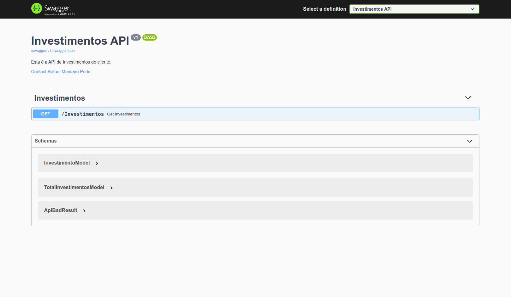
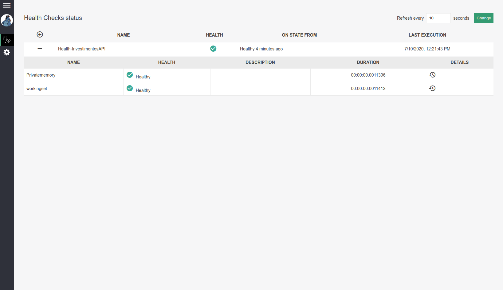

<h1 align="center">Welcome to Investimentos 👋</h1>

  

> Investimentos é um projeto open-source escrito em .Net Core com a aplicação de boas práticas de desenvolvimento.

## Definições de arquitetura
> - Arquitetura em camadas para encapsular os conceitos e permitir que os projetos possam trabalhar de forma independente.
> - Injeção de dependência com o container próprio da Microsoft. Dado a simplicidade da aplicação a solução de DI da Microsoft atende perfeitamente, possui uma excelente resposta e fácil uso.
> - Object values para definir melhor conceitos complexos de campos dos objetos. Foi adotado o uso de Structs, pois não vão para a Heap e permite um controle melhor de dados que são imutáveis.
> - AutoMapper: mapeamento de entidades, desta forma permite-se configurar diversos cenários de mapeamento entre objetos e é possível utilizar a injeção de dependência.
> - Memory Cache: armazenado com duração até as 00:00h do dia seguinte. Com a simplicidade da aplicação e o tamanho de dados necessários, foi adotado o uso de cache em memória e por isto foi adicionado o monitoramento no healthcheck. Caso a aplicação cresça, é recomendável migrar para cache distribuído, por exemplo, Redis. Por este motivo foi criado uma classe para manipular o cache e assim encapsular o conceito permitindo que a aplicação possa alterar a estratégia de cache de forma fácil e rápida.
> - HttpClientFactory: para manipulações de requisições. É uma boa prática utilizar a factory para assim utilizar em injeção de dependência e permitir a configuração de handlers.
> - Http Polly: configurado handlers de Retry e Circuit Breaker, permitindo um controle melhor das requisições.

## UI de documentação e monitoramento
> - Swagger: para UI e documentação da API e permitir uma melhor interação e entendimento de como a API funciona.
> - Healthcheck: com UI para monitoramento da aplicação, para permitir que outras aplicações possam consultar o status da API e permitir também que seja visualizado no dashboard o funcionamento da aplicação.

## Tests
> - xUnit
> - Bogus: para data fake generator. Desta forma pode-se criar objetos de forma mais elaboradas.
> - FluentAssertions: para validação dos testes permitindo escrever com a notação de Fluent validation.
> - Moq: para criação de objetos.

## Usage
- Para utilizar o swagger utilize o endpoint: swagger/index.html

> Healthcheck está disponível nos endpoints:
> - healthchecks-ui (Dashboard)

> - /status (json para consulta de outras aplicações)
## Author

👤 **Rafael Monteiro Porto**

* Twitter: [@Rafael\_M\_Porto](https://twitter.com/Rafael\_M\_Porto)
* Github: [@rafaelporto](https://github.com/rafaelporto)
* LinkedIn: [@rafael-monteiro-porto-858310b7](https://linkedin.com/in/rafael-monteiro-porto-858310b7)

## Show your support

Give a ⭐️ if this project helped you!

***
_This README was generated with ❤️ by [readme-md-generator](https://github.com/kefranabg/readme-md-generator)_
